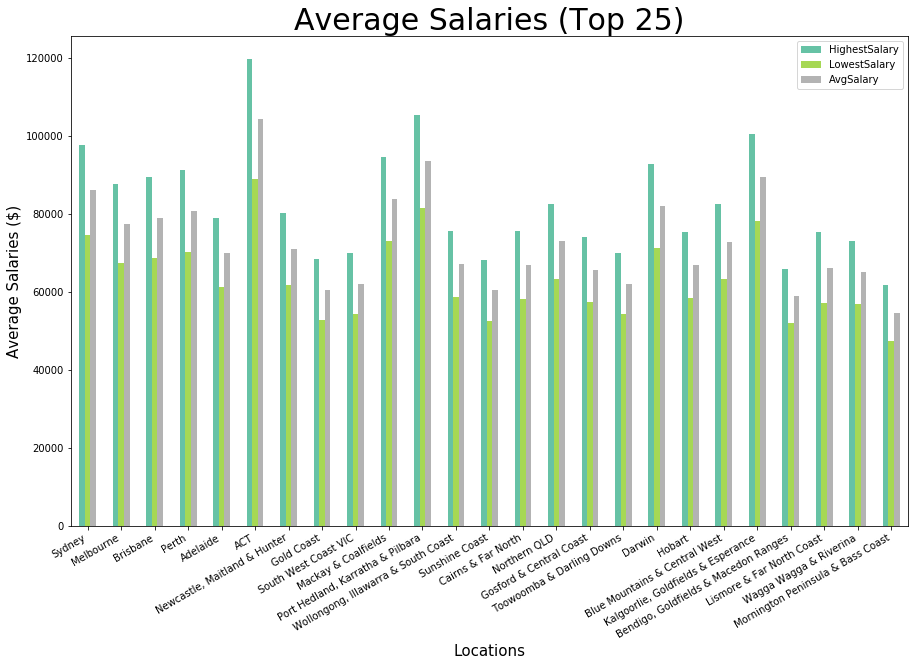

**Info:** The following is a breif overview of data analysis explored across a subset of SEEK data. This has been done by Jarrer Hensel and Lucas Geurtjens.

# Location
## Marketshare

We see that Sydney is our most popular city...
  

ACT has our highest salary...
  

## Popular Mining Locations

 
Interestingly these cities have mining as a popular classification. This is likely because they are all mining cities...
  

## Posting Frequency

As we can see...
  

As we can see...
  

As we can see...
  

## Forecasting

Here is some forecasting we have done. It has shown us that...
  

# Classifications
## Marketshare

We can see most jobs are CEO related and IT related...
  

The salaries are...
  

## IT Sub-Classifications

As we see computer architects have the highest salary...
  

We see the the most popular skill is learning Java..
  
