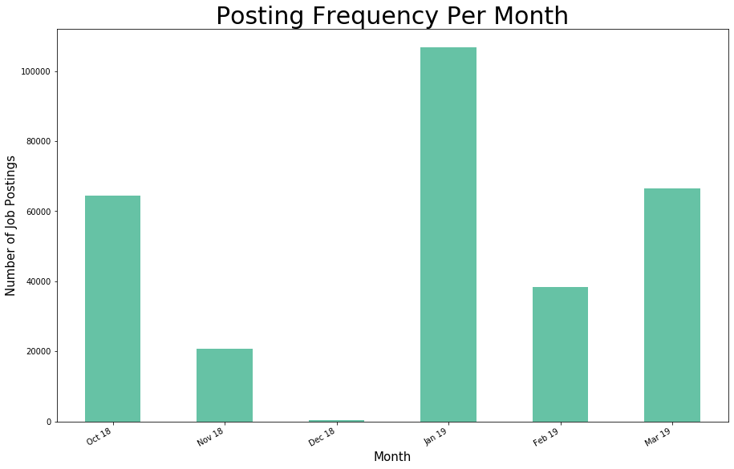
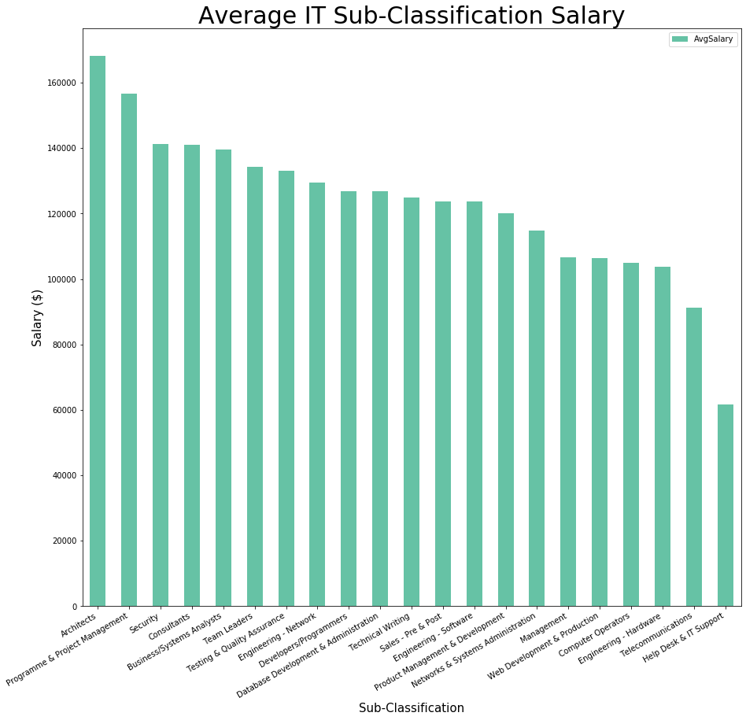

**Info:** The following is a breif overview of data analysis explored across a subset of SEEK data. This has been done by Jarrer Hensel and Lucas Geurtjens.

# Location
## Marketshare

Australia’s most densely populated cities were seen to hold most of the market share job postings, with Sydney being the largest at 31%, followed by Melbourne at 24% and Brisbane at 11%. After that was Perth, Adelaide, ACT, Newcastle, and Gold Coast ranging between 2-7%. The remaining cities all held a market share of less than 1%.
  

ACT job postings were found to have the highest salaries attached, with an average salary of over $100,000. This could be attributed to most jobs in that area consisting of federal government positions which typically pay well. 
  

  
The next highest areas were Port Hedland, Karratha & Pilbara with an average salary of $90,000, followed by Sydney, Mackay & Coalfields, Kalgoorlie Goldfields & Esperance, Darwin, and Perth averaging approximately $85,000. One thing to notice about these smaller areas with such high salaries is that they are all areas with a specific focus on mining jobs as seen by the graphs below:
  

  
The lowest salary locations were seeing to have an average salary of around $60,000. This included places such as Mornington Peninsula & Bass Coast, Bendigo Goldfields & Macedon Ranges, South West Coast, Sunshine Coast, and Gold Coast.
 

## Market Growth Oppotunity

 
It is believed that the IT job market in Perth should be expanded. Perth’s population is approx. 2 million whereas Brisbane has a population of only approx. 2.3 million – this is a difference of 15% in size. Nevertheless, it was found that Perth had only 1092 IT job listings whereas Brisbane has 2,627 listings – this is 58.5% more listings in Brisbane. Thus, it appears there is significant room for the IT industry to grow in Perth to closer match Brisbane.
  

## Posting Frequency

As we can see, job listings frequency is very volatile with clear low periods in the month of December 2018 and around Febuary/March 2019. This could be due to many reasons, so to understand this clearer, we can break it down into monthly periods as seen below:
  

We can see some very revealing trends from this graph, showing a drastic tapering off from 65,000 postings in October 2018 to practically no jobs being posted throughout December. This makes complete sense as it is a time for holidays and celebrations with most businesses slowing down and holding off recruitment until the new year. From this, we see a huge spike in January 2019 with over 100,000 postings as both businesses and job seekers have a renewed motivation and plans for the year ahead. In February we see a big drop off with a rise back to around 65,000 postings in March. 
  

From looking at the days at which jobs were posted, it is seen that most postings occur within the first 20 days, and then taper off towards the end of each month. This is made clearer through looking at the frequency histogram using groups (or bins) of 4 and 6 below:
  

  

## Forecasting

Using Three-Month Moving Average predictions, it is predicted that in April there will be 70561 postings, in May there will be 53889, and in June we will see 57646 postings. There is a limitation with the accuracy of this prediction due to the limited amount of months and the vast volatility around January as a huge, one a year spike. Because of this, we used exponential smoothing with alpha values of 0.2 and 0.8, it predicts that March 2019 postings will be approximately 40,000 and April postings between 50,000 - 60,000.
  

# Classifications
## Marketshare

It was found that Information & Communication Technology (IT) jobs held the highest market share, being 11.73% of the job listings. This is was followed by Trades & Services (9.2%) and Healthcare & Medical with (8.75%). Some of the lowest are CEO & General Management (0.41%), Advertising, Arts & Media (0.39%) and Self Employment (0.05%).
  

In contrast, it appeared the classification with the highest average salary was CEO & General Management, having an average salary of $158,055. This was followed by IT ($131,041) and Consulting & Strategy ($122,655). The lowest average salary was held by Hospitality & Tourism ($41,1374).
  

## Medical Sub-Classifications
As abovementioned, the `Healthcare & Medical` classification only had the 11th highest average salary.
  

However, upon investigating the highest average salary per sub-classification, it was found that both General Practitioners and Medical Specialists had the highest average salary of all sub-classifications (both nearing $200,000).
  

By looking at the average salary for all Healthcare & Medical classification listings, it becomes clear that the average is being skewed by the population of lower-paying sub-classifications (most of which are below $100,000). For example, a Medical Administrator has an average salary of only $50,000. 
  

## IT Sub-Classifications

It was found that the most common IT sub-classification was Developers/Programmers. This was followed by Business/Systems Analysts and Programme & Project Management. The fewest listings were held by Hardware Engineering, Technical Writing, and then Computer Operators. The highest paying IT jobs were Architects, earning an average salary of $168,198. Following this was Programme & Project Management ($156,651) and Security ($141,269). Developers/Programmers job listings had a midrange average salary of $126,880. Help Desk & IT Support had the lowest average salary of $61,622.
  

Finally, a set of popular technologies were queried against the requirements of the IT job listings. It found that Java was the most mentioned technology, mentioned by 353 unique classifications. This was followed by AWS (248 mentions), and SQL (215 mentions). Python had midrange mentions of 101. Rust, Matlab, Objective-C, and C# did not have any mentions.
  
